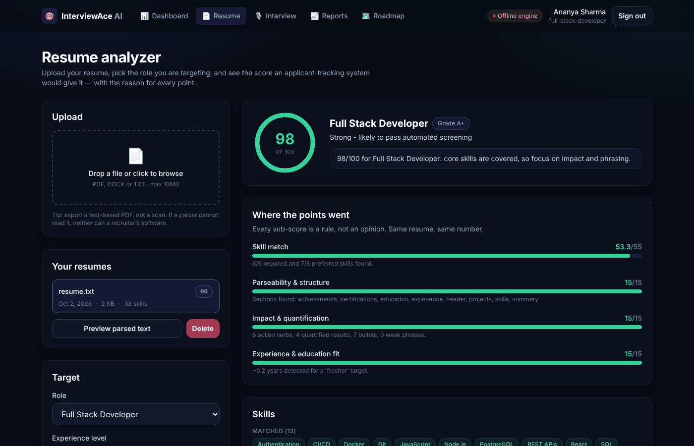
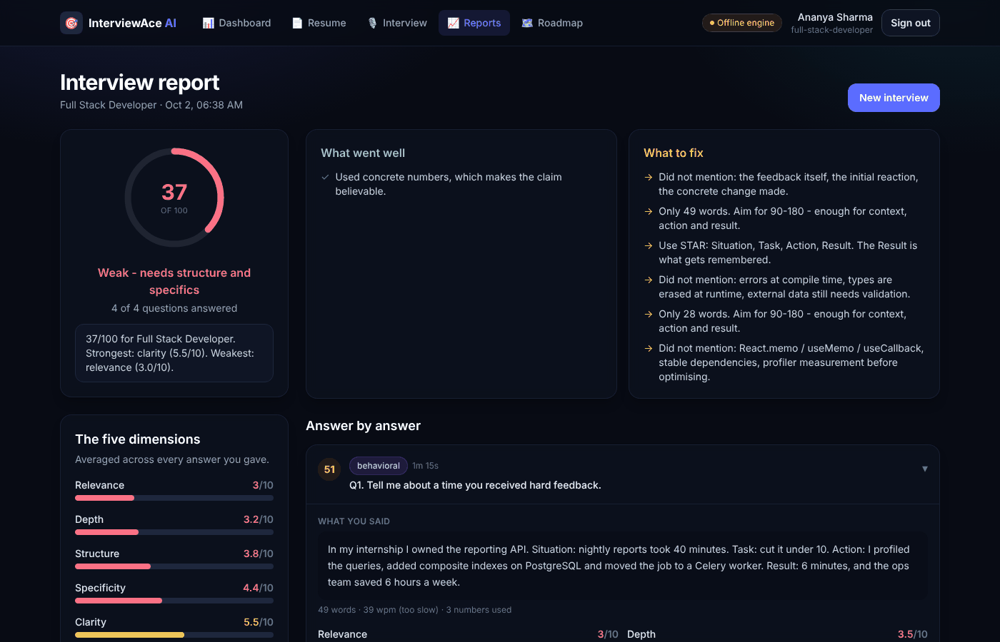
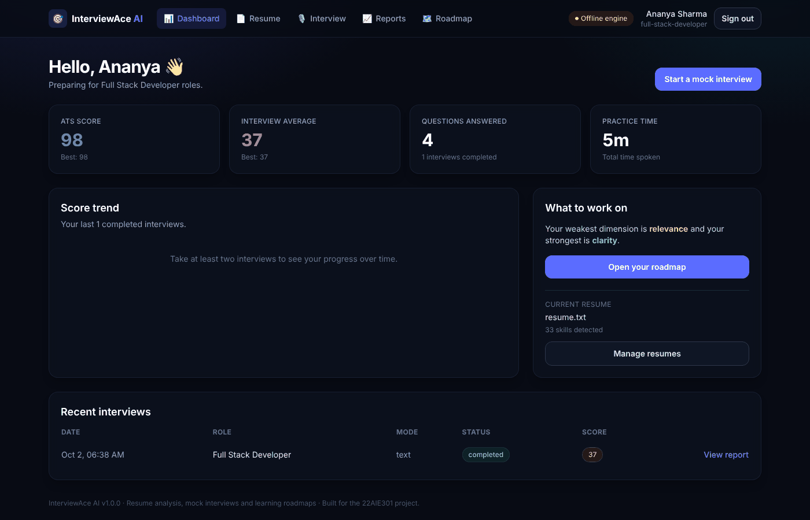
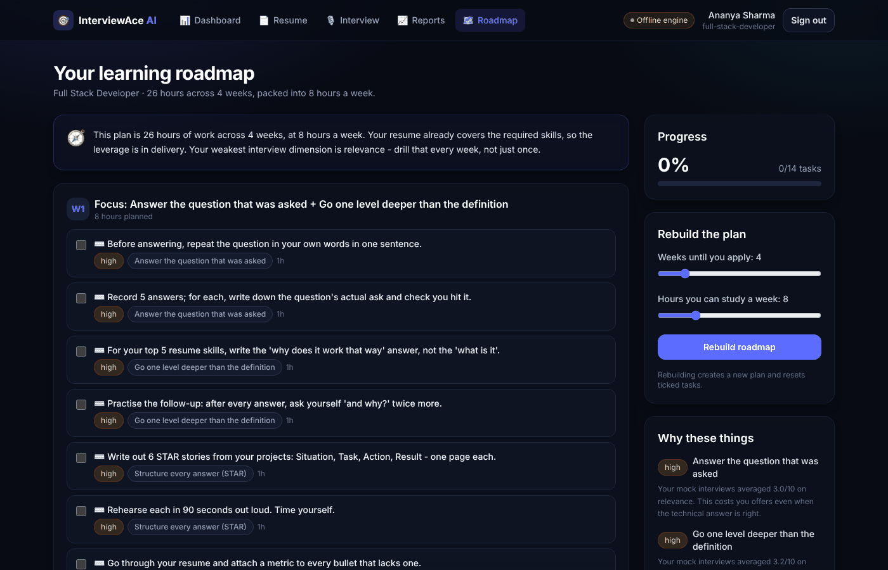
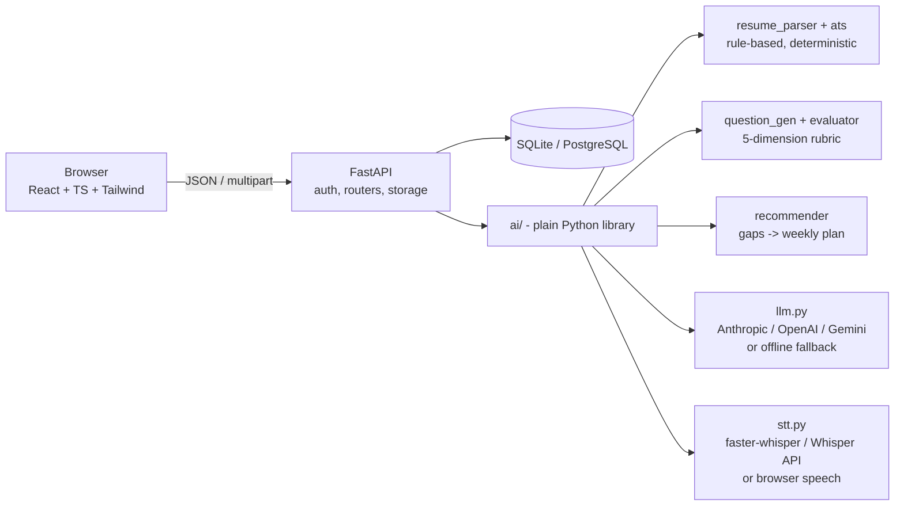

# InterviewAce AI


An AI-powered interview preparation platform. Upload your resume, get the score
an applicant-tracking system would give it, sit a voice mock interview generated
from your own projects, and get a week-by-week study plan built from the gaps
that interview exposed.

Built for the 22AIE301 course project, combining full stack development (CSE Core) with
applied AI (CSE AI).

| Resume analysis | Interview report |
|---|---|
|  |  |
| **Dashboard** | **Learning roadmap** |
|  |  |

<sub>Screenshots use the fictional sample resume in `tests/fixtures/` and the offline engine (no API key).</sub>

## Architecture



`ai/` imports no web framework and no database; `backend/` contains no scoring
logic; `frontend/` renders what the API returns. Details in
[docs/ARCHITECTURE.md](docs/ARCHITECTURE.md).

---

## Quick start

**Windows**

```bash
run.bat
```

**macOS / Linux**

```bash
./run.sh
```

That installs anything missing, starts both servers and opens the app:

| | |
|---|---|
| Web app | http://localhost:5173 |
| API docs (Swagger) | http://localhost:8000/docs |

No API key, no database server and no model download are required. See
[docs/SETUP.md](docs/SETUP.md) if you would rather run the steps by hand.

Other commands:

```bash
run.bat setup
```

```bash
run.bat test
```

```bash
run.bat stop
```

---

## It works with nothing configured

This is the design decision everything else follows from.

Every AI feature has a real, useful fallback that needs no API key and no
network. Add `ANTHROPIC_API_KEY` (or `OPENAI_API_KEY`, or `GEMINI_API_KEY`) to
`.env` and questions get written from your actual resume text and answers get
graded by a model. Leave it empty and a curated question bank plus a heuristic
scorer take over.

The header badge always shows which one is running, so a demo can never
silently claim credit the offline engine did the work for.

| Feature | With an API key | With nothing configured |
|---|---|---|
| Resume parsing | rules (identical) | rules (identical) |
| ATS score | rules (identical) | rules (identical) |
| Question generation | written from your resume | curated bank, matched to your skills |
| Answer scoring | model against a rubric | heuristic against the same rubric |
| Speech to text | faster-whisper or Whisper API | browser Web Speech API |
| Roadmap | same plan + a written coach note | same plan + a templated note |

---

## What it does

| # | Module | What it actually does |
|---|---|---|
| 1 | Authentication | Email + password, bcrypt, JWT. First account matching `ADMIN_EMAIL` becomes the admin. |
| 2 | Dashboard | ATS score, interview average, score trend, weakest dimension. |
| 3 | Resume upload | PDF / DOCX / TXT → text, contact details, sections, skills. Shows you exactly what the parser read. |
| 4 | Resume analyzer | 0-100 ATS score across five weighted sub-scores, plus the missing skills and the fixes. |
| 5 | Role & company selection | 10 roles, 5 company interview styles, each with a different question mix. |
| 6 | AI interview | Questions read aloud, answered by voice, transcribed live. |
| 7 | Coding interview | Coding problems reviewed statically (never executed — see [docs/ARCHITECTURE.md](docs/ARCHITECTURE.md)). |
| 8 | Reports | Every answer scored on five dimensions, next to what a strong answer contains. |
| 9 | Learning roadmap | Your gaps packed into the hours you actually have per week, with progress tracking. |
| 10 | Admin dashboard | Platform usage and whether the AI engines are live. |

---

## The two numbers this product produces

**The ATS score is arithmetic, not opinion.** Five sub-scores, fixed weights,
100 points. The same resume always produces the same number, and every point is
traceable to a rule shown in the UI.

```
Skill match       40   do you have the skills the role asks for
Job description   15   do you use the words in THIS posting
Parseability      15   can software read the file at all
Impact            15   do bullets show results, not duties
Fit               15   experience and education against the level
```

With no job description supplied, its 15 points move to skill match, so a
resume is never punished for something the candidate did not provide.

**The interview score is a rubric, not a vibe.** Every answer is scored 0-10 on
five named dimensions, weighted differently per question type — behavioural
answers live or die on structure, technical ones on depth:

```
relevance     did they answer THIS question
depth         technical substance, not surface recitation
structure     is the answer organised (STAR for behavioural)
specificity   concrete examples, numbers, named tools
clarity       could a listener follow it - fillers, pace, length
```

That is the product promise: not "you scored 68", but "your depth is fine, your
structure is not, here is this week's drill".

---

## Layout

```
interviewace-ai/
├── ai/                  the intelligence layer - plain Python, no web framework
│   ├── llm.py           the ONLY file that talks to a model provider
│   ├── stt.py           the ONLY file that turns audio into text
│   ├── resume_parser.py PDF/DOCX/TXT -> structured resume
│   ├── skills_db.py     role taxonomy, company profiles, learning resources
│   ├── ats.py           the ATS score
│   ├── question_gen.py  question generation + the coding bank
│   ├── evaluator.py     answer scoring + interview summary
│   └── recommender.py   skill gaps -> weekly roadmap
├── backend/             FastAPI: models, schemas, auth, routers
├── frontend/            React + TypeScript + Tailwind (Vite)
├── database/            PostgreSQL schema.sql + seed.sql
├── docs/                setup, architecture, API reference, project plan
├── tests/               92 tests, no network or API key needed
├── run.bat / run.sh     one-command launcher
└── .env.example         every setting, with safe defaults
```

---

## Tech stack

**Frontend** React 18 · TypeScript · Tailwind CSS · Vite · React Router
**Backend** FastAPI · SQLAlchemy 2 · Pydantic v2 · PyJWT · bcrypt
**Database** SQLite by default, PostgreSQL by changing one line in `.env`
**AI** Anthropic / OpenAI / Gemini behind one interface, plus offline engines
**Speech** faster-whisper or Whisper API server-side, Web Speech API in-browser

---

## Tests

```bash
python -m pytest tests -q
```

92 tests, about 9 seconds, no network and no API key. They cover the parser,
the scorer, question generation, the evaluator, the roadmap packer, auth and
access control, and the full candidate journey end to end. The LLM seam is
tested by substituting a fake provider — see `tests/test_llm_seam.py`.

---

## Documentation

- [docs/SETUP.md](docs/SETUP.md) — installation, PostgreSQL, API keys, local Whisper, deployment
- [docs/ARCHITECTURE.md](docs/ARCHITECTURE.md) — how it fits together and why
- [docs/API.md](docs/API.md) — every endpoint with request and response examples
- [docs/PROJECT_PLAN.md](docs/PROJECT_PLAN.md) — 12-week plan, team split, milestone checklist
